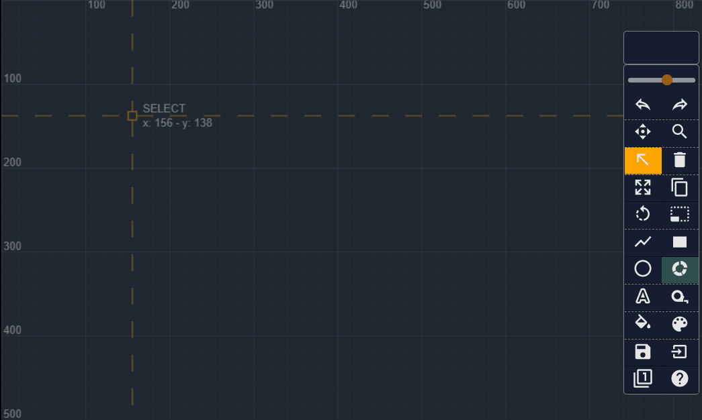

# WEB-CAD

I've always been fascinated by 2D and 3D CAD Software and WEB-CAD is my effort in Vanilla ES6 Javascript and HTML5 CANVAS API to make my own (...ultra ligth...) version.

## Features
- [x] Lines, circles and rectangle and square shapes 
- [x] Select, move, copy, delete, resize and rotate operations on shapes
- [x] Interpolated Animation for creating, moving and copying shapes
- [x] Pan & Zoom System
- [x] UNDO & REDO System
- [x] "Snap to Grid" System (with 6 steps)
- [x] Text and Measures 
- [x] Draggable Commands panel with Color palette
- [x] Import and export drawings in .json format
- [x] Grey/White/Blue themes
- [x] Multiple Unit System (simple switch among units, tens and hundreds) 

## Todos
- [ ] Multiple selection
- [ ] Layers
- [ ] Groups and Explode commands
- [ ] Blocks

# Demo
[check the app online](https://web-cad-2020.netlify.app/) or test things locally by just installing dependancies with `npm i`and running the local development environment with `npm start`.  SVG Icons courtesy from [materialdesignicons.com](https://materialdesignicons.com/).

## Bugs
- Uhm, please help me know...!

## License
This project is licensed under the ISC License.